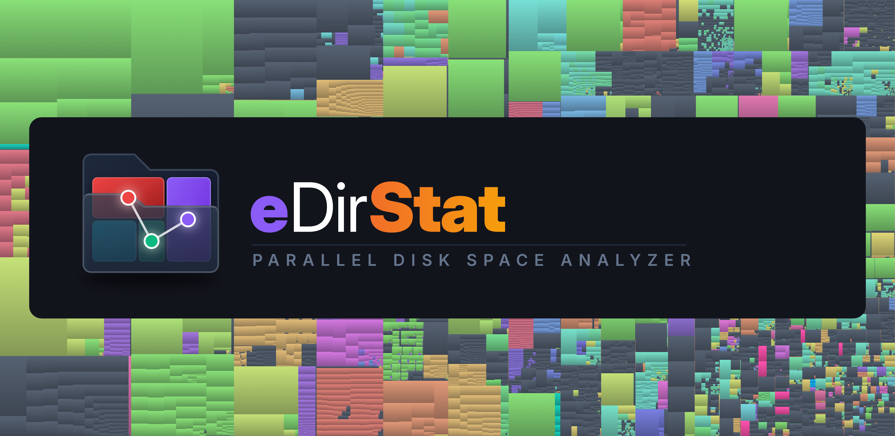
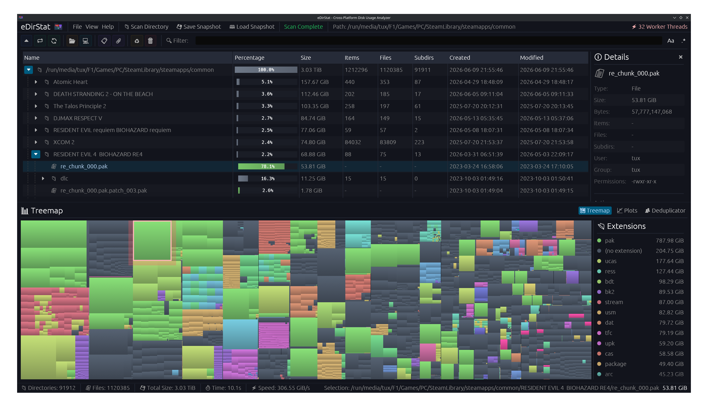
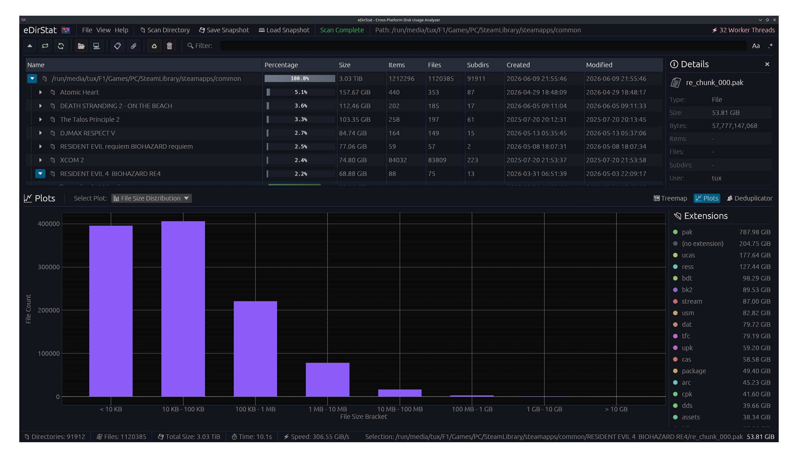
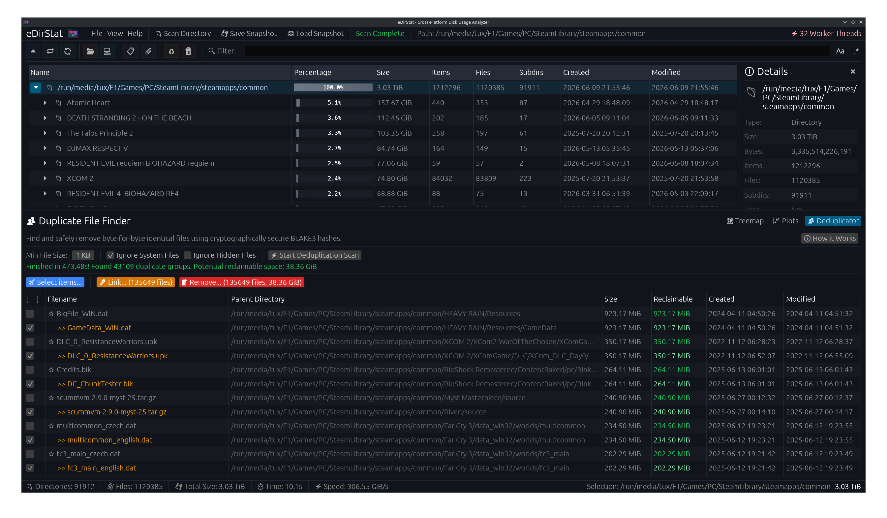

# DataTree



[](LICENSE)

**DataTree** is a Windows-first disk usage analyzer built on the [eDirStat](https://github.com/Xangelix/edirstat) engine (MIT). It adds everyday disk-hygiene workflows inspired by tools like WizTree and WinDirStat: **Allocated** size, a sortable **File View**, **CSV export**, and size-aware search—while keeping eDirStat's fast NTFS `$MFT` path, treemap, plots, deduplicator, and compressed snapshots.

The product name is **DataTree**. Internal crate names remain `edirstat*` so upstream engine changes are easier to merge.

> DataTree is an independent project. It is not affiliated with, sponsored by, or endorsed by WizTree, WinDirStat, or eDirStat's commercial distribution.

---

## Highlights

- **Tree View & File View** — Browse the directory tree or a virtualized list of every file sorted by allocated size.
- **Size & Allocated** — Logical file size and on-disk cluster allocation in the table, treemap (allocated by default), and details panel.
- **NTFS `$MFT` scanning** — Direct Master File Table reads on elevated Windows NTFS volumes; falls back to a parallel walk when MFT is unavailable.
- **Search operators** — Filter by name, glob (`*.iso`), and size (`<100m`, `a>=1g`) in the filter bar.
- **CSV export** — Export Tree View or File View from the GUI or CLI (`--export`, `--files-only`).
- **UI timing bench** — `--bench-ui` prints JSON with `scan_ms`, `layout_ms`, and `time_to_interactive_ms`.
- **Everything else from eDirStat** — Interactive treemap, extension stats, plots, BLAKE3 deduplicator, `.edst` snapshots, 18-language UI, themes, and hardlink-aware duplicate handling.

---

## Screenshots



| Plots & analysis | Deduplicator |
|---|---|
|  |  |

---

## Windows notes

| Topic | Detail |
|---|---|
| **Administrator** | NTFS `$MFT` scanning requires elevation. Without it, DataTree uses a parallel directory walk. The status bar shows `Engine: MFT` or `Engine: Walk`. |
| **Toolchain** | Windows builds need the **nightly** Rust toolchain (`windows_by_handle`). See `rust-toolchain.toml`. |
| **SmartScreen** | Local unsigned `datatree.exe` builds may trigger SmartScreen. That is expected until you sign the binary. |
| **Speed** | Scan speed is **not** guaranteed to beat WizTree or other tools. Use `--bench-ui` on your own machine instead of relying on third-party comparison tables. |

---

## Quick start

### Build

```powershell
git clone https://github.com/msandroid/DataTree.git
cd DataTree

# Nightly is required on Windows.
cargo build --release -p edirstat
```

Binaries:

- `target\release\datatree.exe` — primary GUI / CLI entry point
- `target\release\edirstat.exe` — same binary (compatibility alias)

### Run the GUI

```powershell
.\target\release\datatree.exe
.\target\release\datatree.exe C:\Users\You\Downloads
```

### Headless CLI

```powershell
# Scan timing report
.\target\release\datatree.exe C:\ --benchmark

# UI path timing (2 warmup + 3 measured passes, JSON on stdout)
.\target\release\datatree.exe C:\ --bench-ui

# CSV export (Tree View: directories + files)
.\target\release\datatree.exe C:\ --export report.csv

# CSV export (File View: files only)
.\target\release\datatree.exe C:\ --export files.csv --files-only

# Save a compressed snapshot
.\target\release\datatree.exe C:\ --to snapshot
```

`--bench-ui` emits one JSON line, for example:

```json
{"scan_ms":12.345,"layout_ms":0.456,"time_to_interactive_ms":12.801,"engine":"Walk","files":12034,"dirs":2103,"warmup":2,"measured":3}
```

Run it twice if you want to compare a cold cache against a warm cache. `time_to_interactive_ms` is `scan_ms + layout_ms` in this headless path.

### Installer (optional)

Build a release binary, then compile `installer.iss` with [Inno Setup](https://jrsoftware.org/isinfo.php):

```powershell
cargo build --release -p edirstat
# Output: staging\datatree-setup-x86_64.exe
```

---

## Using DataTree

### Explorer tabs

- **Tree View** — Hierarchical table with columns for Name, %, Size, **Allocated**, item counts, and timestamps. Child folders default to sorting by allocated size descending.
- **File View** — Flat, virtualized list of files only. Click a row to select it in the tree, expand parents, and sync the treemap.

### Filter syntax

With regex mode **off**, the filter bar accepts:

| Pattern | Meaning |
|---|---|
| `report` | Name contains `report` (case-insensitive by default) |
| `*.iso` | Extension is `iso` |
| `<100m` | Logical size under 100 MiB |
| `>=1g` | Logical size at least 1 GiB |
| `a>=1g` | Allocated size at least 1 GiB |

Suffixes: `k`, `m`, `g`, `t` (1024-based). Combine tokens: `*.iso <100m backup`.

### Treemap metric

**View → Treemap uses Allocated** toggles whether rectangles are sized by allocated or logical size. Allocated is the default.

### CSV export

**File → Export CSV** writes:

```text
File Name,Size,Allocated,Modified,Files,Folders
```

Paths are written without the `\\?\` extended-length prefix. When File View is active, only files are exported (same as `--files-only` on the CLI).

### Snapshots

DataTree writes snapshot format **v4** (logical size + allocated). Older v2/v3 `.edst` files still load; v3 copies `size` into `allocated`.

```powershell
.\target\release\datatree.exe C:\Projects --to projects
# Creates projects.edst.zst (Zstd-compressed)
```

Load snapshots from **File → Load Snapshot** in the GUI.

---

## Command-line reference

```text
datatree [PATH] [OPTIONS]

Arguments:
  PATH    Directory to scan, or an .edst / .edst.zst snapshot to open in the GUI

Options:
  --benchmark          Headless scan timing report
  --bench-ui           Scan + treemap layout timing as JSON (warmup 2, measured 3)
  --export <FILE>      Export CSV and exit
  --files-only         With --export: omit directories (File View)
  --to <DEST>          Headless scan; save snapshot to DEST.edst.zst
  --no-compression     With --to: write uncompressed DEST.edst
  -x, --same-filesystem Restrict traversal to one filesystem / volume
  -h, --help           Print help
```

---

## Keyboard shortcuts

| Action | Windows / Linux | macOS |
|---|---|---|
| New scan | <kbd>Ctrl+O</kbd> | <kbd>⌘O</kbd> |
| Rescan | <kbd>Ctrl+R</kbd> / <kbd>F5</kbd> | <kbd>⌘R</kbd> / <kbd>F5</kbd> |
| Save snapshot | <kbd>Ctrl+S</kbd> | <kbd>⌘S</kbd> |
| Search / filter | <kbd>Ctrl+F</kbd> | <kbd>⌘F</kbd> |
| Focus in treemap | <kbd>Enter</kbd> | <kbd>Enter</kbd> |
| Treemap up one level | <kbd>Alt+↑</kbd> | <kbd>⌥↑</kbd> |
| Move to trash | <kbd>Del</kbd> | <kbd>Del</kbd> |
| About | <kbd>F1</kbd> | <kbd>F1</kbd> |

---

## Architecture (short)

DataTree inherits eDirStat's design:

1. **Parallel walker** — Work-stealing directory traversal (`crates/edirstat/src/engine/traversal.rs`).
2. **NTFS MFT engine** — Raw `$MFT` parsing on Windows when elevated (`crates/edirstat/src/engine/mft.rs`).
3. **Coordinator** — Workers stream `ScanEvent`s; the GUI reads immutable snapshots via `arc_swap`.
4. **Arena** — Flat `FileNode` array with `size` and `allocated` (`crates/edirstat-core/src/arena.rs`).
5. **Snapshots** — Columnar v4 `.edst` with optional Zstd wrapper (`crates/edirstat-core/src/snapshot.rs`).

---

## Privacy

All analysis runs locally. No telemetry, analytics, or cloud upload of paths or file contents. See [PRIVACY.md](PRIVACY.md).

---

## Upstream & license

- **Upstream engine:** [Xangelix/edirstat](https://github.com/Xangelix/edirstat) (MIT). Set `upstream` remote to track it: `git remote add upstream https://github.com/Xangelix/edirstat.git`
- **DataTree** is licensed under the [MIT License](LICENSE). Original eDirStat copyright notices remain in `LICENSE`.
- **Trademarks:** WizTree, WinDirStat, and QDirStat are trademarks of their respective owners.

### Contributors (engine)

Credit for the underlying eDirStat project and its contributors remains with the upstream repository. DataTree-specific changes are maintained in this fork.
